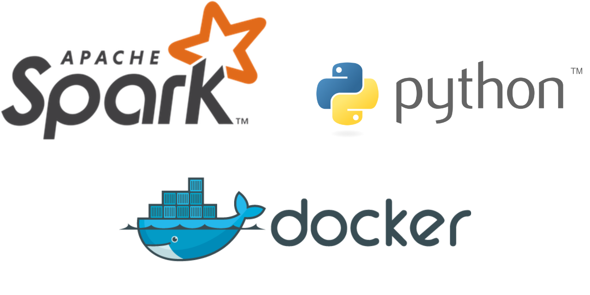

This repository is going to house all of my experimental PySpark scripts. I may set up a CI/CD pipeline to build Docker images with required JARs later.

## Setup

Clone this repository and do poetry install.

To run the Spark containers based on the image I build, refer to the [spark-image](#spark-image) section below.

## Structure

The experiments/ folder contains all the Jupyter notebooks and the spark-image/ directory houses the latest Dockerfile and other binaries that I bundle with my version of Spark, and the rest of the files are according to their standard definitions in Python Poetry projects and Github repositories.

## .env

Create a .env file in the root of this project and fill in the following values:

- SPARK_MASTER: The endpoint for the Spark master (if you're deploying based on the commands I provided above, this will be spark://localhost:7077/)
- MINIO_ENDPOINT: The endpoint for the Minio installation
- MINIO_USER: The user for the Minio installation
- MINIO_PASSWORD: The password for the Minio installation

## Spark-image

To build the Docker image, just run docker build -t <repo>/<project>:<tag> spark-image.
And then run it, forwarding ports (7077 for master, 8080 for worker etc.) and configuring as required.
For example, to deploy one master and one worker:

```code
docker network create spark-net # To create a Docker network where the containers can access each other by their host names
```

```code
# To run the master
docker run -d \
  --name spark-master \
  --network spark-net \
  -p 7077:7077 -p 8080:8080 \
  <repo>/<project>:<tag> \
  bash -c "/opt/spark/sbin/start-master.sh && tail -f /opt/spark/logs/\*.out"
```

```code
# To run the worker
docker run -d \
  --name spark-worker-1 \
  --network spark-net \
  -e SPARK_WORKER_CORES=2 -e SPARK_WORKER_MEMORY=2g \
  -p 8081:8081 \
  <repo>/<project>:<tag> \
  bash -c "/opt/spark/sbin/start-worker.sh spark://spark-master:7077 && tail -f /opt/spark/logs/\*.out"
```

Or simply use Docker Compose. The docker-compose.yaml file sets up 3 things:

- A spark-net network for the containers in the compose deployment to communicate with each other
- 1 spark-master container
- 2 spark-worker containers

```code
docker compose up -d
```

I will set up CI/CD later.
